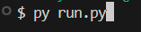
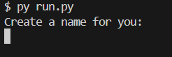
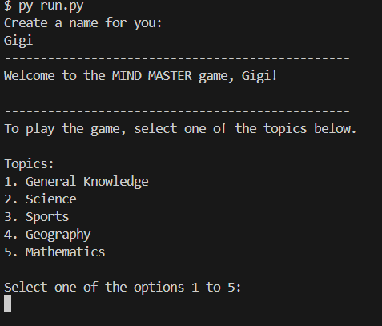
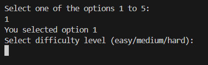
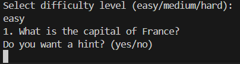
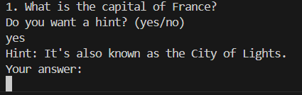
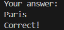
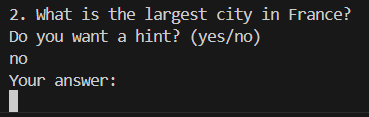
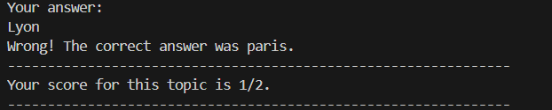

# Mind Master Quiz Game

Welcome to the Mind Master Quiz Game! This is an interactive quiz game that challenges your knowledge across various topics. The game allows you to choose from different topics, answer questions, and receive feedback based on your performance.

[Live project hosted on Heroku]:()
## Features

* User-Friendly Interface: Prompts the user to input their name and select quiz topics.

* Variety of Topics: Choose from topics like General Knowledge, Science, Sports, Geography, and Mathematics.

* Feedback System: Receive feedback based on your quiz performance.

* Navigation Options: Decide whether to return to the home page or exit the game after completing a quiz.

## How to Run

1. [Cloning of the Repository Code locally] (#Cloning-of-the-Repository-Code-locally)

* Mind Mastery repository URL: [https://github.com/yourusername/mind-master-quiz-game]

* Navigate to the Project Directory:
    * cd mind-master-quiz-game

* Run the Program

    * Execute the following command to start the game: python run.py
  
        

* The game will prompt you to enter your name and select a quiz topic. Follow the on-screen instructions to play.
        
    

    

    

    

    

    

    

    
    
## Functions Overview

* get_user_name()
Prompts the user to create a name. Ensures the input is non-empty.

* display_topic_options()
Displays a list of available quiz topics to choose from.

* get_topic_selection()
Prompts the user to select a valid topic option from 1 to 5.

* provide_feedback(score, total_questions)
Provides feedback based on the user's score out of the total number of questions.

* end_of_quiz_prompt()
Prompts the user to decide whether to return to the home page or exit the game.

* main()
Runs the main quiz game setup, handles user interactions, and tracks the score. It controls the flow of the game, from selecting topics to providing feedback and managing game sessions.

## Cloning of the Repository Code locally

* Go to the Github repository that you want to clone.
* Click on the Code button located above all the project files.
* Click on HTTPS and copy the repository link.
* Open the IDE of your choice and and paste the copied git url into the IDE terminal.
* The project is now created as a local clone.

## Contact

For any issues or contributions, please contact 
- bicahaadiyah@gmail.com