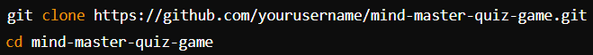
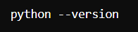
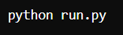
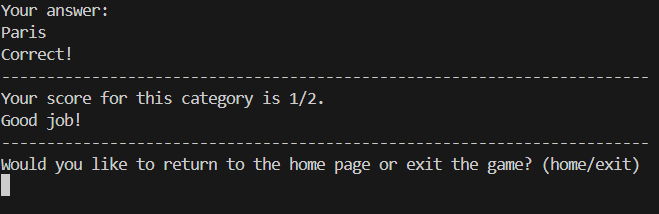
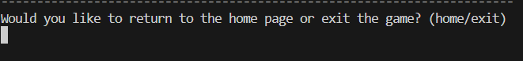
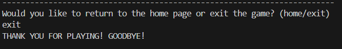
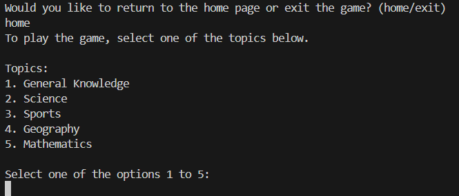

# 🧠🎓 Mind Master Quiz Game

Welcome to the MIND MASTER Quiz Game! This is an interactive quiz application designed to test your knowledge across various topics with different difficulty levels. This README provides detailed instructions on how to use, install, and contribute to the project.

[Live project hosted on Heroku]:()

 Mind Mastery repository URL: [https://github.com/HBica05/MindMastery.git]

## 🔍 Overview
The MIND MASTER Quiz Game is a Python-based quiz application that allows users to answer questions from multiple topics. Users can choose from various topics and difficulty levels to tailor the quiz to their preferences. The application provides feedback based on user performance and allows them to continue or exit after each quiz session.

## ✨ Features

* Interactive Quiz: Users can select from different quiz topics and difficulty levels.

* Hints: Optional hints are provided for each question to help users.

* Feedback: After completing the quiz, users receive feedback based on their performance.

* Easy Navigation: Users can choose to return to the home page or exit the game after completing a quiz.

## 🔧 Installation
### Prerequisites

* Python 3.x installed on your system.

* Basic knowledge of how to run Python scripts.

### Steps to Install

1. Clone the Repository
   
    [How-to-clone](#🔄-Cloning-of-the-Repository-Code-locally)

   * git clone (https://github.com/HBica05/MindMastery.git)
   
   * cd mind-master-quiz-game(project directory)

    

2. Ensure Python Environment.
* Make sure you have Python 3.x installed. You can verify this by running:
  
    

1. Navigate to Project Directory
 * Change to the directory where the run.py and questions.py files are located.  

2. Run the Application

* Execute the following command to start the quiz game:  
      

## 🚀 Usage
### Running the Game
1. Start the Game

* Run the run.py script using Python. The application will prompt you to enter a name and select a quiz topic.
     
    

    

2. Select a Topic

* You will be presented with a list of topics. Choose a number corresponding to the topic you want to be quizzed on.
    
    

3. Choose Difficulty Level

* After selecting a topic, you will be asked to choose a difficulty level: easy, medium, or hard.
    
    

4. Answer Questions

* Answer the questions as they appear. You can request a hint if needed.

5. Review Feedback

* After answering all questions, the game will provide feedback on your performance and your final score.
  

    
6. Continue or Exit

You will have the option to return to the home page or exit the game.

   * If exit is selected, a message is displayed, 
    

   * otherwise it returns to the main menu and the game starts all over again.

## 📂 File Structure
* `run.py`: The main script that runs the quiz game. Handles user input, displays questions, and provides feedback.
  
* `questions.py`: Contains quiz questions categorized by topic and difficulty level. Provides functions to retrieve and filter questions.

## 🔍 Functions Overview
### `run.py`
* `get_user_name()`
    * Prompts the user to create a name. Ensures the input is non-empty.

    * Returns: User's name as a string.

* `display_topic_options()`
    * Displays a list of available quiz topics to choose from.

* `get_topic_selection()`
    * Prompts the user to select a valid topic option from 1 to 5.

    * Returns: Selected topic option as a string.

* `provide_feedback(score, total_questions)`
    * Provides feedback based on the user's score out of the total number of questions.

* `end_of_quiz_prompt()`
    * Prompts the user to decide whether to return to the home page or exit the game.

      * Returns: Boolean value (`True` for "home" and `False` for "exit").

* `main()`
    * Runs the main quiz game setup, handles user interactions, and tracks the score. It controls the flow of the game, from selecting topics to providing feedback and managing game sessions.
### `questions.py`
1. `get_questions()`

    * Returns a dictionary of quiz questions categorized by topic and difficulty level.
  
2. `ask_multiple_questions(topic, difficulty_level)`
   
   *  Asks a set of questions based on the selected topic and difficulty level, validates answers, and calculates the score.
  
## 🤝 Contributing
* Contributions to the MIND MASTER Quiz Game are welcome! If you'd like to contribute, please follow these guidelines:

* Fork the Repository: Create your own fork of the repository.
* Clone Your Fork: Clone the forked repository to your local machine.
* Create a Branch: Create a new branch for your changes.
* Make Your Changes: Implement your changes or improvements.
* Test Your Changes: Ensure your changes work as expected and do not introduce bugs.
* Submit a Pull Request: Push your changes to your fork and submit a pull request to the original repository.

# 🧪 Testing
To ensure the functionality of your quiz game, I followed these testing guidelines:

## 1. Unit Testing
 * To verify that each function in run.py and questions.py behaves as expected.

* Setup:

  - Ensured I had Python installed.

    ### Testing Functions in `run.py`:
      * `get_user_name()`:
        * Tested with different inputs, including valid names and empty strings.
        * Ensured it correctly handles empty inputs and returns a valid name.

      * `get_topic_selection()`:
        * Tested with valid and invalid inputs.
        * Ensured it returns a valid topic option and prompts again for 
        invalid inputs.

    * `provide_feedback(score, total_questions)`:
        * Tested with different score and total question values.
        * Verified that the feedback message corresponds to the score ranges.
    
    * `end_of_quiz_prompt()`:
        * Tested with valid inputs ("home" and "exit") and invalid inputs.
        * Ensured it returns True for "home" and False for "exit".

    ### Testing Functions in `questions.py`:

      * `get_questions()`:
        * Verified the structure and content of the returned dictionary.
        * Ensured it contains the correct questions and details for each topic.
      * `ask_multiple_questions(topic, difficulty_level)`:
        * Mock user input to simulate answering questions.
        * Tested with various topics and difficulty levels.
        * Verified that scores are calculated correctly and responses are accurate.

## 🐞 Bugs
* No bugs remaining
* Bugs such as `variable not defined` were encountered during the development of the application. Corrected by making sure that correct spelling of the variable was used.
* Exception-handling errors: Fixed by providing a user with a meaningfull message if an unexpected value is input.
* trailing whitespace: Indentation was fixed.

## 🔄 Cloning of the Repository Code locally

* Go to the Github repository that you want to clone.
* Click on the Code button located above all the project files.
* Click on HTTPS and copy the repository link.
* Open the IDE of your choice and and paste the copied git url into the IDE terminal.
* The project is now created as a local clone.

## 🛠️ Deployment
I deployed the Mind Mastery Quiz using Heroku’s dashboard, which offers an intuitive interface for deploying web applications. Here’s the process I followed:

* Logged into Heroku: I accessed my Heroku account and went to the dashboard. I clicked the "New" button and selected "Create new app". I then provided a unique name for the app and chose the appropriate region.

* Configuring Environment Variables: I set up the required environment variables in the Heroku dashboard under the "Settings" tab for my application.

* Connecting to GitHub: In the deployment section of my Heroku app dashboard, I chose GitHub as the deployment method. I linked my GitHub account and selected the repository that holds the code for my Mind Mastery code.

* Installing the Python Buildpack: In the settings section of my Heroku app dashboard, I went to the "Buildpacks" area and added the Python Buildpack. This step was necessary to ensure that my application could manage the Python dependency required for the template.

* Configuring Automatic Deploys: Once GitHub was connected, I enabled automatic deploys for my app. This setup allowed Heroku to automatically deploy updates whenever I pushed changes to the linked GitHub repository.

* Manual Deployments: I also had the option to manually trigger deployments from the dashboard. I could choose a branch to deploy and start the deployment process with a single click.

* Verifying Deployment: After the deployment process was complete, I checked that my application was functioning correctly by visiting the Heroku URL provided in my web browser.

## 🙏 Credits
* I am deeply grateful to my mentor, Spencer Barriball, for their exceptional guidance and support throughout this project. Their insights and assistance were crucial to its success.

- **[Code Institute learning materials](https://codeinstitute.net/)**: For providing comprehensive learning resources and guidance throughout the development process.

- **[Heroku](https://www.heroku.com/)**: The platform provided seamless deployment and hosting services for the application.

- Inspiration video for the Mind Mastery Game: (https://youtu.be/zehwgTB0vV8?si=1vWFn7zUA0-1SeJX)

- A big inspiration for my README file was from : (https://github.com/zioan/pp3_inventory.git)
- Code ideas were taken from ()
- Other code inspirations were taken from (https://stackoverflow.com/)

## 📞 Contact
For any issues or contributions, please contact: bicahaadiyah@gmail.com

[Back to Top](#Mind-Master-Quiz-Game)